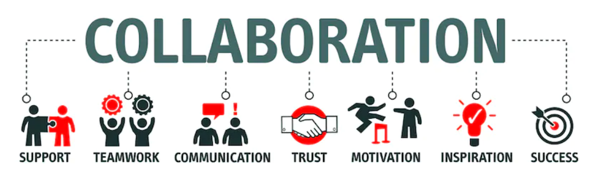
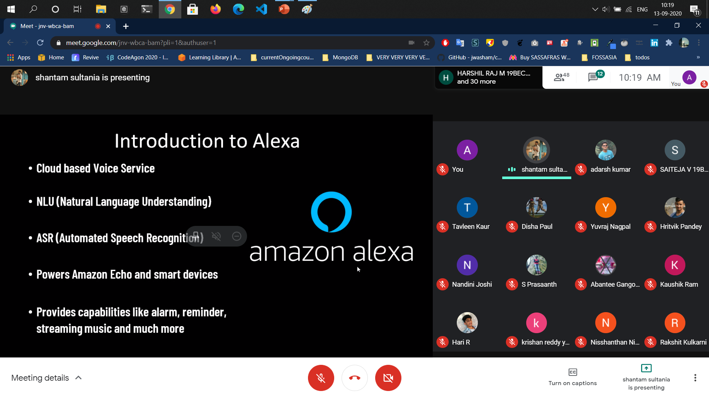

# Collabs

I would love to collaborate with your community for any upcoming events on Open Source.
  

### Just create an issue [here](https://github.com/imabp/Collabs/issues) sharing me about your event and the community.

# Past Events

### Introduction to NodeJS and Azure Deployment
1. Collaboration with Major League Hacking (MLH) Hack Season 2021
2. In this event, I talked on NodeJS Architecture, Eventloops, Callbacks with Code Visualization, concluding finally with deployment of a NodeJS app on azure.
3. Recording [here](https://www.youtube.com/watch?v=hY_8F2aM-yc&ab_channel=HackTheMountains)

### Getting started with Alexa
1. Collaboration with Alexa Developers Community
2. In this event, I described the whole high level system design of  Alexa Service by Amazon Ask API.

### Tech Phantoms 101 Meet
1. Being Community lead of [Tech Phantoms](https://github.com/tech-phantoms) onboarded official members for this open source community.
2. Introduction to our Core Mentor [Vinit Shahdeo ](https://github.com/vinitshahdeo)
3. In this 101 meeting, we discussed our goals, one of our production projects, KLADI, for Facebook Open Source ,  and plans for the community?

