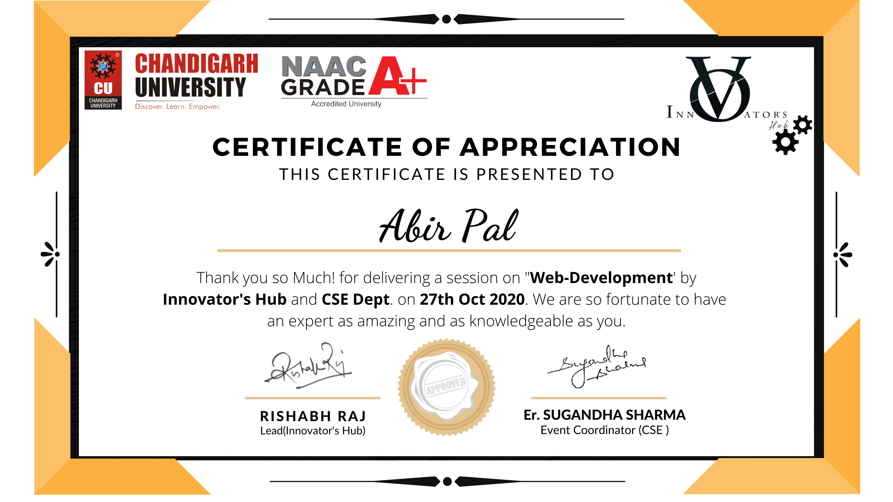
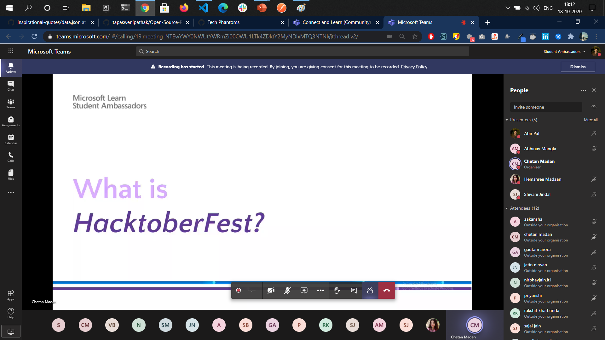
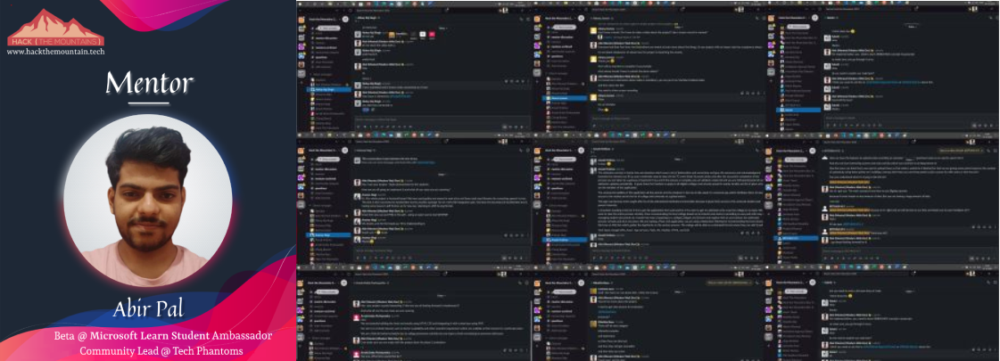

# Collabs

I would love to collaborate with your community for any upcoming events on Open Source.
  

### Just create an issue [here](https://github.com/imabp/Collabs/issues) sharing me about your event and the community.

# Past Events

### Expert Speaker At  Department of CSE, Chandigarh University
1. Invited as Expert Speaker at Chandigarh University for Web Development.
2. Spoken on Modern Web Development and discussed roadmaps to get started.
3. Attendance: 200 Students.

### Webinar with Bhartiya Vidyapeeth College of Engineering New Delhi
1. Took a collaborative session with BVPCE in this Hacktoberfest 2020. 
2. Topics covered were about Open Source, Git and GitHub, various paid open source programs and internships.

### MLH-Hack The Mountains - Mentor (Modern Web Dev)
1. Mentoring over 400 students with Major League Hacking (MLH) Hack Season 2021 under Modern Web Dev category.
2. Most doubts, were on building APIs, using services like Shashido, React, SQLite, DJango and Flask.

### Introduction to NodeJS and Azure Deployment
1. Collaboration with Major League Hacking (MLH) Hack Season 2021
2. In this event, I talked on NodeJS Architecture, Eventloops, Callbacks with Code Visualization, concluding finally with deployment of a NodeJS app on azure.
3. Recording [here](https://www.youtube.com/watch?v=hY_8F2aM-yc&ab_channel=HackTheMountains)

### Getting started with Alexa
1. Collaboration with Alexa Developers Community
2. In this event, I described the whole high level system design of  Alexa Service by Amazon Ask API.

### Tech Phantoms 101 Meet
1. Being Community lead of [Tech Phantoms](https://github.com/tech-phantoms) onboarded official members for this open source community.
2. Introduction to our Core Mentor [Vinit Shahdeo ](https://github.com/vinitshahdeo)
3. In this 101 meeting, we discussed our goals, one of our production projects, KLADI, for Facebook Open Source ,  and plans for the community?

